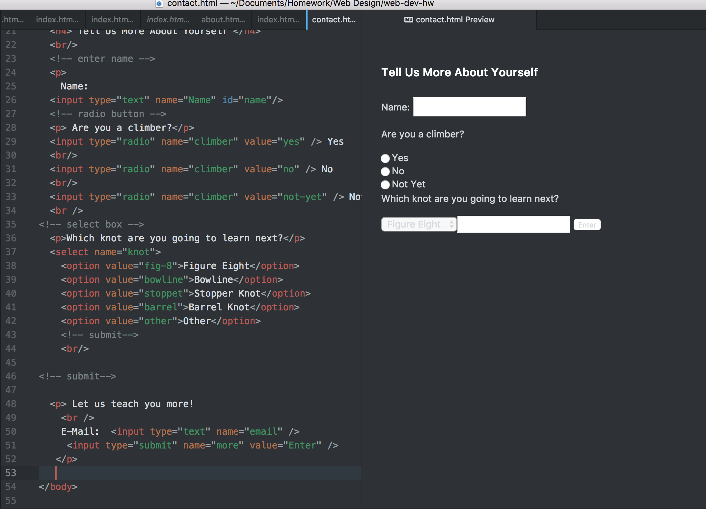

<h1> Project 2 </h1>
<h2> Mary Ross </h2>

I found this project was a nice way to solidify what we have learned in the HTML section of this course. Though I did find myself reviewing the material often, I was also surprised by how much I remembered.
 

I'm excited to go into more detail as far as personalizing the sites that we make from here on out. It should be interesting to add more elements to the work I've done so far.

 

I was switching back and forth between our class website and atom quite a bit during the process of this project but I found that the repetition of certain elements was helpful and by the contact portion of the project my coding was flowing more easily. Overall, I would not say that I have found HTML to be challenging, rather something that requires some time and a bit of trial and error.  

Here is a screenshot of my work:

